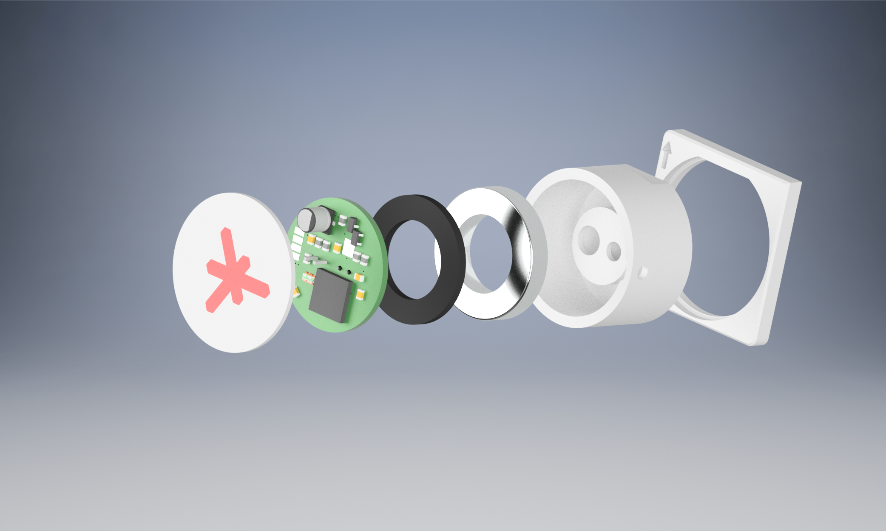

# sml-rw-head

## Overview

**sml-rw-head** is a versatile read-write module designed to attach to power meters via a magnet.
It reads the SML (Smart Message Language) or ODT stream from the D0 interface of the meter.
Additionally, the device is equipped to send pulses for entering the PIN or navigating through the menu of the meter
and for example toggle the info mode.

This project encompasses three main components:

1. **Hardware:** Includes schematics and PCB (Printed Circuit Board) designs.
2. **3D-Printable Parts:** Consists of printable components that complement the hardware.
3. **Code:** The code is an implementation example
of the sml-rw-head device.

Each major component has its dedicated directory with its own README.md for detailed information.

## Project Structure

- **Hardware:** The hardware files are located in the `./hardware/d0reader` subdirectory. Refer to the [Hardware README](./hardware/d0reader/README.md) for specifics.

- **3D-Printable Parts:** Find 3D-printable files in the `./hardware/3d-print` subdirectory. More details are available in the [3D-Print README](./hardware/3d-print/README.md).

- **Code:** The source code is in the `./code/sml_rw` subdirectory. To get started with the code, please check the [Code README](./code/sml_rw/README.md).

## Usage

Before using the sml-rw-head module, make sure to review the documentation for each component. Follow the guidelines provided in the respective READMEs for successful integration into your project.

### Preparation
Before using the sml-rw-head module, you need to configure the device using the `ftprog_template.xml` file. Import the file and perform the configuration using the [ftprog](https://ftdichip.com/utilities/) software supplied by FTDI.

## Contributions

Contributions to the sml-rw-head project are welcome! If you have ideas, improvements, or bug fixes, please feel free to submit issues or pull requests.

## License

This project is licensed under the [MIT License](LICENSE). See the LICENSE file for more details.
